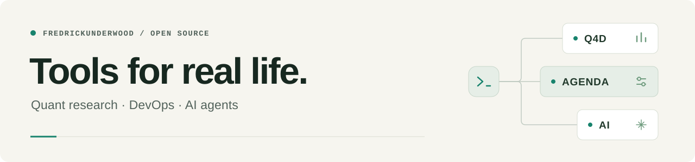

  <a href="https://github.com/FredrickUnderwood">English</a> · <strong>简体中文</strong>

<picture>
  <source media="(prefers-color-scheme: dark)" srcset="./assets/header-dark.svg">
  <source media="(prefers-color-scheme: light)" srcset="./assets/header-light.svg">
  
</picture>

## 你好，我是 Fredrick

曾在字节跳动从事研发，现在独立做项目。我把日常遇到的问题，做成自己和家人能用的工具，也把它们分享在这里。

主要关注 **量化研究**、**自托管基础设施** 和 **AI 开发工具**，常用 Go、TypeScript 和 Python。

## 核心项目

<table>
  <tr>
    <td width="50%" valign="top">
      <h3><a href="https://github.com/FredrickUnderwood/Quant4Dad-OpenSource">Q4D · Quant4Dad</a></h3>
      
<strong>本地优先的量化研究工作台。</strong>

      
将行情数据、策略回测和事件流水线整合到一个工作台，支持可选的 AI 助手与 MCP 接入。

      
默认 SQLite · 支持 Docker 部署

      
<code>Go</code> <code>React</code> <code>TypeScript</code> <code>SQLite</code>

      
<a href="https://github.com/FredrickUnderwood/Quant4Dad-OpenSource#readme">了解 Q4D →</a>

    </td>
    <td width="50%" valign="top">
      <h3><a href="https://github.com/FredrickUnderwood/Agenda-V2">Agenda</a></h3>
      
<strong>面向 Vibe Coders 的自托管研发平台。</strong>

      
在自己的服务器上部署应用，通过统一控制台管理路由、HTTPS、日志、监控与告警。

      
Docker Compose · 蓝绿部署

      
<code>Go</code> <code>React</code> <code>TypeScript</code> <code>Docker</code>

      
<a href="https://github.com/FredrickUnderwood/Agenda-V2/blob/master/README.zh-CN.md">了解 Agenda →</a>

    </td>
  </tr>
</table>

## 更多作品

| 项目 | 解决什么问题 | 技术栈 |
| :--- | :--- | :--- |
| **[PaiGo](https://github.com/FredrickUnderwood/PaiGo)** | 受 Pi Agent 启发的可组合 AI Agent SDK，封装流式输出、工具执行和多轮编排。 | Go |
| **[Vibe Debugger](https://github.com/FredrickUnderwood/Vibe-Debugger)** | 通过本地服务与 MCP，让 Claude Code 直接读取浏览器控制台输出、网络请求和运行时错误。 | Go · TypeScript |
| **[Vibe with Xbox](https://github.com/FredrickUnderwood/vibe-with-xbox)** | 把 Xbox 手柄变成 macOS 遥控器，用来操作 Claude Code、听写和 tmux。 | Python |

## 一起交流

如果你正在使用这些工具，欢迎聊聊你在做什么、遇到了哪些问题。可以在对应仓库提交 Issue，也欢迎 Bug 反馈、想法和 Pull Request。

[浏览全部仓库 →](https://github.com/FredrickUnderwood?tab=repositories)
