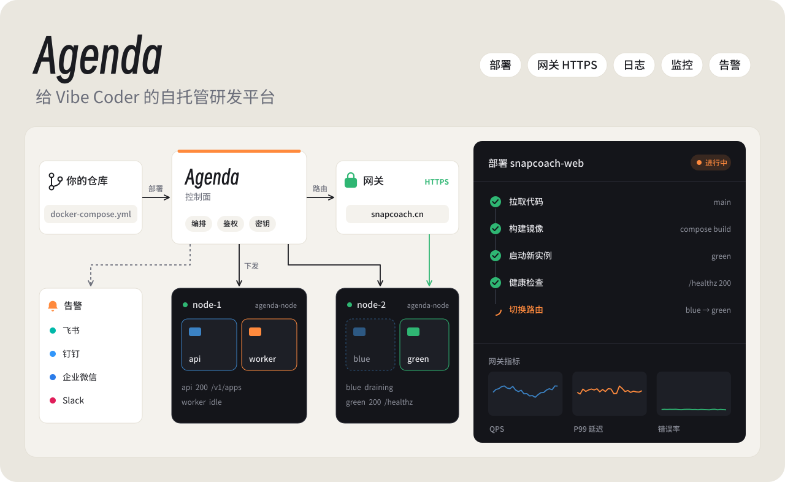

  <a href="https://github.com/FredrickUnderwood">English</a> · <strong>简体中文</strong>

<picture>
  <source media="(prefers-color-scheme: dark)" srcset="./assets/header-zh-dark.svg">
  
</picture>

  
  &nbsp;
  
  &nbsp;
  <a href="https://github.com/FredrickUnderwood"><picture>
    <source media="(prefers-color-scheme: dark)" srcset="./assets/social-github-dark.svg">
    
  </picture></a>

还做了：<a href="https://github.com/FredrickUnderwood/PaiGo">PaiGo</a> / <a href="https://github.com/FredrickUnderwood/Vibe-Debugger">Vibe Debugger</a> / <a href="https://github.com/FredrickUnderwood/vibe-with-xbox">Vibe with Xbox</a>

